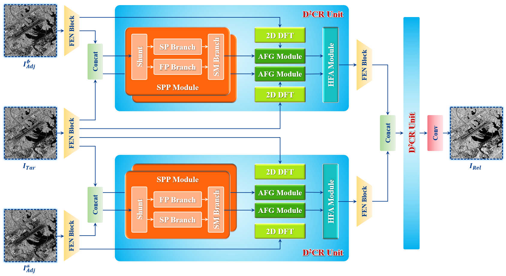

# Collaborative Dual-Domain Perception Network for Unsupervised Despeckling of Sentinel-1 Dual-Polarization SAR Images

Official PyTorch implementation of the paper  
**"Collaborative Dual-Domain Perception Network for Unsupervised Despeckling of Sentinel-1 Dual-Polarization SAR Images"**

By **Jiangong Xu**, **Yang Yang**, **Weibao Xue**, **Xiaoyu Yu**, **Junli Li**, **Jun Pan**, and **Mi Wang**  


[]()
[]()

---

## 🚀 Abstract

> Despeckling of real dual-polarization SAR data remains challenging due to the absence of clean reference images and the complex statistical characteristics of speckle noise. Although existing unsupervised deep learning methods have shown promising performance, they still have limited ability to exploit temporal correlations among multitemporal observations and often overlook physical constraints embedded in polarimetric information, resulting in incomplete structural recovery and scattering distortion. To address these issues, this article proposes **CD2P-Net**, a collaborative dual-domain progressive network for real dual-polarization SAR image despeckling. Built upon an enhanced multitemporal Noise2Noise paradigm, the proposed method jointly models spatial, frequency-domain, and temporal dependencies to fully exploit speckle independence and temporal coherence across adjacent acquisitions. In addition, covariance statistics and polarimetric decomposition cues are incorporated to enhance the physical consistency of learned representations. Extensive experiments on real dual-polarization Sentinel-1 time-series data demonstrate that **CD2P-Net** consistently outperforms representative existing methods in both quantitative and visual evaluations, while effectively preserving spatial details, polarimetric fidelity, and semantic integrity.

> <p align="center">
>  
> </p>

---

## 📊 Dataset Description

We constructed a large-scale multitemporal Sentinel-1 **dual-polarization SLC dataset** that preserves both amplitude and phase information — essential for speckle modeling and physical scattering consistency.

### Specifications
| Property | Description |
|-----------|-------------|
| **Coverage** | 18 distinct regions across China |
| **Temporal Structure** | Triplets: (target + two auxiliary acquisitions) |
| **Patch Size** | 256×256 pixels |
| **Total Samples** | 41,004 patches |
| **Split Ratio** | 5:1 (Train : Test) |

### Preprocessing
Performed using **ESA SNAP** and **PolSARPro**, including:
- Orbit correction  
- Radiometric calibration  
- Polarimetric decomposition (H/A/α)  
- Coherency/Covariance matrix generation  

### Download
📦 Links to [here (Baidu Cloud)](https://pan.baidu.com/s/1iwMNjt2CjvE4fKSMozXXHQ?pwd=1111) download the data. Password: `1111`
```
Sentinel-1 time-series data/
├── S01/
│ ├── S01_Ass_S1A_YYYYMMDDTHHMMSS/ # Auxiliary 1
│ ├── S01_Ass_S1A_YYYYMMDDTHHMMSS/ # Auxiliary 2
│ └── S01_Tar_S1A_YYYYMMDDTHHMMSS/ # Target
├── ...
└── S18/
└── Basic information.xlsx
```

**Naming Convention:**
- `Tar`: Target phase for despeckling  
- `Ass`: Auxiliary temporal phases  
- `S01–S18`: 18 geographical regions  
- `S1A/S1C`: Sentinel-1 satellite identifier  

---

## 🧠 Network Overview

### Core Modules
| Module | Function |
|---------|-----------|
| **SPP (SFS_Conv)** | Shunt Parallel Perception — spatial–frequency fusion using FrGT/FrFT filters |
| **AFG** | Adaptive Feature Gating — learnable frequency-domain modulation |
| **HFA** | Holistic Feature Aggregation — combines CFR-SA and DFR-SA mechanisms |
| **DDCR** | Dual-Domain Collaborative Refinement — integrates SPP, AFG, and HFA |
| **R²A Group** | Recursive Residual Aggregation — progressive temporal refinement |
| **CollaborativeLoss** | Combines fidelity, edge, and temporal losses with uncertainty weighting |

---

## 📂 Repository Structure

```
MTPI-Net/
├── modules/
│ ├── SPP.py # Shunt Parallel Perception module
│ ├── AFG.py # Adaptive Feature Gating module
│ ├── HFA.py # Holistic Feature Aggregation module
│ ├── D2CR.py # Dual-Domain Collaborative Refinement
│ ├── CD2PT_Net.py # Main network (FEN + R2A + DDCR)
│ ├── losses.py # Collaborative optimization loss
├── train.py # Training script
├── inference.py # Inference script
├── requirements.txt # Dependencies
├── README.md
└── checkpoints/ # Model weights
```

---

## ⚙️ Environment Setup

```bash
conda create -n mtpi python=3.9
conda activate mtpi
pip install -r requirements.txt
```

## 🏋️ Training

```
python train.py --epochs 60 --batch_size 8 --lr 1e-4 --device cuda
```

### Settings:
- Optimizer: AdamW
- LR schedule: CosineAnnealing (1e-4 → 1e-6)
- Loss: CollaborativeLoss (σ-weighted multi-term)
- Checkpoints: saved automatically in ./checkpoints/

## 🔍 Inference
```
python inference.py \
    --model_path ./checkpoints/mtpi_epoch_060.pth \
    --save_dir ./results
```
### Output:
- .npy despeckled image files
- Optional .tif export (enabled via tifffile)

## 📜 Citation

If you use this code or dataset, please cite:
```
@article{Xu2026CD2PT,
  title={Collaborative Dual-Domain Perception Network for Unsupervised Despeckling of Sentinel-1 Dual-Polarization SAR Images},
  author={Xu, Jiangong and Yang, Yang and Xue, Weibao and Yu, Xiaoyu and Li, Junli and Pan, Jun and Wang, Mi},
  journal={XXXX},
  year={2026}
}
```
## 📄 License
This project is released under the **MIT License**.
© 2026 Jiangong Xu et al. All rights reserved.

🙌 Acknowledgments

- This implementation references **ESA SNAP** and **PolSARpro** for preprocessing, and builds upon the PyTorch deep learning framework.
- We thank the **Sentinel-1 mission** team for their constructive feedback and data support.
- For the construction of the SPP Module, we referenced [**SFS-Conv**](https://github.com/like413/SFS-Conv/tree/main).


